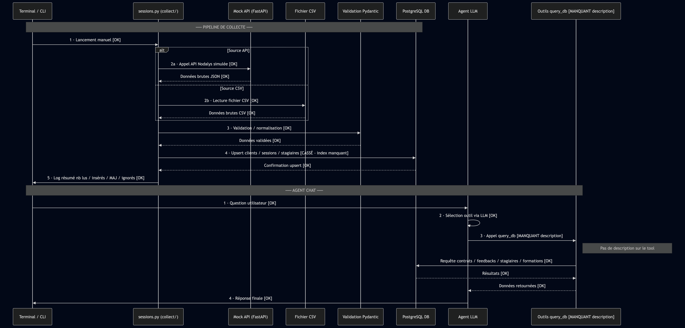

## Comment le pipeline existant est-il organisé ? Quelles sont ses grandes étapes et dans quel ordre s'enchaînent-elles ?
**Organisation des dossiers :**
- Dans `/collect`, on récupére des données à partir de l'API ou de fichiers CSV et on les insère dans la base de données.
- une base de données postgresql qui stocke les données (tables clients, sessions, contrats, feedbacks)
- Dans le dossier `/mock_api`, une api FastApi qui simule l'api Nodalys en utilisant un mock des données.
- Dans le dossier `/collect`, des collecteurs qui récupèrent des données de l'api Nodalys ou de fichiers CSV et les stockent dans la base de données.

**Le pipeline de collecte fonctionne en 4 étapes :**
1. on lance sessions.py
2. on récupère les enregistrements bruts (API, CSV…)
3. on valide / normalise avec pydantic
4. on upsert les clients, sessions et stagiaires en base de données
5. on loggue un résumé (nb lus, nb insérés, nb mis à jour, nb ignorés)




## Qu'est-ce qui fonctionne déjà et qu'il ne faut surtout pas casser ?
Le chat fonctionne déjà et ne faut surtout pas le casser. Il fonctionne en 3 étapes :
  1. le chat se lance dans un terminal et on peut lui poser des questions sur les données de la base de données.
  2. l'agent reçoit la question et l'envoit à un LLM qui détermine quel outil utiliser pour répondre à la question.
  3. les outils permettent de questionner la base de données concernant les contrats, feedbacks, stagiaires et formations.
  4. l'agent répond à la question en utilisant les données de la base de données.

## Qu'est-ce qui manque ou est cassé ? Comment l'avez-vous repéré (exécution, lecture du code, messages d'erreur) ?
- Il y a un problème avec les migrations. On s'en rend compte en lançant un `make migrate` qui échoue avec cette erreur :
```
Index de performance sur contrats.statut + date_signature. is not present
```
- Le tool `query_db` utilisé par l'agent n'a pas de description ce qui le rend peu utilisable. On le voit en lisant le code de l'agent ou en lançant le chat.

## Quelles conventions votre prédécesseur·e a-t-il/elle posées (nommage, formats, structure des fichiers) et que vous devez respecter pour rester cohérent·e ?
- les collecteurs doivent suivre le même format que collect/sessions.py`
- les fichiers Python sont documentés avec des docstrings.
- les migrations sont nommées en commençant par un numéro de version qui est incrementé à chaque migration.

## Y a-t-il des données personnelles collectées à tort dans l'existant, au regard du mémo RGPD ?